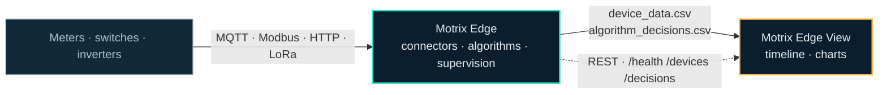

# Motrix Edge View

**EDGE VIEW** · What the site did, on one timeline.

[](LICENSE)
[](.nvmrc)
[](#deployment)
[](https://github.com/Motrix-Energy/motrix-edge/blob/main/docs/storage-format.md)

An offline, single-file viewer for [Motrix Edge](https://github.com/Motrix-Energy/motrix-edge) output. Load the CSVs the
EMS writes and see what your devices reported and what your algorithms decided, on one
synchronised timeline.

It ships as **one `index.html`** with every dependency inlined. Double-click it. No server,
no install, no network — an EMS lives on a site LAN, and a debugging tool that needs the
internet to render is the wrong shape.

The viewer is fully generic: every device name, algorithm name and chartable field is
discovered from the data. Nothing is hardcoded, so it works with devices and algorithms
that did not exist when it was written.



---

## Try it in five minutes

**A. Download and open** — grab `index.html` from the
[latest release](../../releases/latest) and double-click it. Drag in
`data/storage/device_data.csv` and `data/storage/algorithm_decisions.csv` from an EMS run.

No EMS run to hand? The repository ships one:
`test/fixtures/auto_toggle/expected/` holds real EMS output — 54 readings and 18 decisions
from three simulated devices and the `AutoToggle` algorithm. Drag both CSVs in.

**B. From the EMS repository**, generate your own in about a second:

```bash
python main.py --config examples/auto_toggle/config.json
```

**C. Develop:**

```bash
npm ci
npm run dev
```

Node 22 or newer (22.12+ recommended — Vite warns below that). The dev server proxies
`/api` to `http://localhost:8000`, so a locally running EMS with a `rest_api` service is
reachable. **The dev proxy has no gate in front of it** — the Basic auth lives in the
container's nginx, so `npm run dev` never asks you to sign in.

The interface is in English, French, Dutch and German, picked from your browser and
changeable in the header. Timestamps stay ISO-8601 in every language, deliberately: a value
you read off a chart has to be greppable in the CSV it came from.

---

## What it does

**Charts.** Pick any numeric field from any device or algorithm. Series of different
magnitudes get their own y-axis automatically — a temperature and a power on one axis makes
the temperature a flat line, so units decide where a device volunteers one and magnitude
decides otherwise. Zooming one chart zooms them all and moves a shared crosshair, and
zooming *refines*: the visible window is downsampled to the pixel budget, so the closer you
look the more real samples you see.

**Timeline.** Every reading and every decision, merged chronologically across every loaded
dataset, virtualised so a hundred thousand rows scroll smoothly. Filter by dataset, kind,
actor or free text — the facets intersect, so picking a device really does hide everything
else. Click a row to expand its full payload.

**Several runs at once.** Datasets are a list, not a switch. Load two backtests side by
side and compare them; switch the x-axis to **t₀-normalised** and two runs from different
years superimpose.

**Live, when an EMS is reachable.** A running EMS becomes one more dataset beside the
loaded backtests — not a mode — so a live feed and a 2013 replay share one chart. Charts
follow the live edge until you zoom, and stop following the moment you do. A separate
**Live status** page shows what has no time axis at all: health, the replay clock and who a
stuck step is waiting on, every device's readiness and capabilities, every worker's restart
count.

Three things about live mode are true and worth knowing before you trust it:

- **Decisions depend on the EMS's version.** One that serves `GET /decisions` streams them
  here beside the readings, from the moment you connect onwards — the viewer starts at the
  present rather than replaying the EMS's buffer. One that does not answers 404, the viewer
  stops asking, and the UI says so; load `algorithm_decisions.csv` alongside to see them.
- **The viewer does the sampling.** `/devices` is a snapshot endpoint, so a point appears
  only when a payload actually changes — a flat stretch means nothing changed, not that
  nothing was measured.
- **A backgrounded tab stops polling** and says so. Browsers throttle background timers to
  about one a minute; continuing would thin the samples thirtyfold and pretend nothing had
  happened.

**It tells you what it could not read.** Unparseable timestamps, malformed payloads, rows
that step backwards, timestamps carrying no timezone — all reported with row numbers rather
than silently dropped.

---

## Data format

The viewer reads the two CSVs written by the EMS's `csv_file` storage backend. The
normative contract is [`docs/storage-format.md`](https://github.com/Motrix-Energy/motrix-edge/blob/main/docs/storage-format.md) in the
EMS repository — read it before changing a parser here. This build targets **storage format
1.0** (`motrixStorageFormat` in `package.json`).

It also reads two files that are not storage output, both recognised from their contents
rather than their names:

- **A replay input** (`timestamp,device_name,topic,payload`) — the CSV the pseudo connector
  replays. Loaded beside the `device_data.csv` from the same run, it is the only way to see a
  payload the EMS *rejected*: no row is written for one, so an input with no reading at the
  same instant is the evidence. Series from it are qualified by topic, because one device
  publishes several and their payloads differ.
- **A `config.json`** — the run's topology, as an overlay rather than a dataset. It answers
  the one question the CSVs cannot: a device that was configured and produced nothing writes
  no rows, and neither does a device that was never configured. Only names, kinds, classes,
  connectors and protocols are read — hosts, usernames, passwords, topics, ports, register
  maps and file paths are never read and never shown.

Two things about that format are worth knowing before you trust a chart:

- **A gap means "no reading received".** The EMS writes no row when a device's payload is
  rejected, deliberately, so a stalled meter reads as missing data rather than as a flat
  line. Charts break the line rather than interpolating across it.
- **Timestamps do not all carry a timezone.** A live run stamps naive local time; a replay
  stamps whatever the replay file carried. One file routinely holds both. Naive stamps are
  read as local to *this* machine, and any dataset containing one is badged `naive TZ`.

`test/fixtures/` vendors the EMS's own golden fixture, checksum-verified against the
manifest it publishes. That fixture is the interface between the two repositories: when it
drifts, the tests here fail rather than a user's chart quietly going wrong. Re-vendor with:

```bash
npm run fixtures:update
```

---

## Deployment

```bash
docker build -f docker/Dockerfile -t motrix-edge-view .
docker run --rm -p 127.0.0.1:8080:8080 \
  -e VIEWER_USER=ops -e VIEWER_PASSWORD="$(openssl rand -base64 18)" \
  motrix-edge-view
```

Run like this, on its own, it is the file-mode viewer served over HTTP: open
`http://localhost:8080` and drop your CSVs in. There is no EMS beside it, so `/api/*` answers
502 and the app stays in file mode — the name `edge` is resolved per request, so its absence
never stops nginx from starting.

**Both variables are required.** The container exits non-zero rather than start without
them: this nginx is the only authentication in front of the EMS, so an image that invented
a default would be publishing that password in the same breath. If you want no gate at all,
say so — `VIEWER_AUTH=off` — and if you want your own accounts, mount an `.htpasswd` and
set `VIEWER_AUTH=file`.

The image is nginx plus one HTML file. It reverse-proxies `/api/*` to `edge:8000` across the
compose network, so the browser only ever sees one origin — which is why the EMS API needs
no CORS middleware and why its port is never published to the host.

You do not have to build it. A tag publishes the image to GHCR, and the EMS repository's
`docker-compose.yml` carries a `viewer` profile that pulls it — `VIEWER_IMAGE` and
`VIEWER_TAG` select which one, and both sides end up on the same network with nothing
published but `127.0.0.1:8080`:

```bash
docker compose --profile viewer up -d
```

The tag is always explicit, never `:latest`. A floating tag would silently change what a
deployment runs on the next pull, and the version boundary between these two repositories
is a pin all the way down.

Live mode needs the EMS's `config.json` to declare a `rest_api` service. Without one,
`/api/health` returns a 502, the viewer's boot probe reads that as "no live EMS", and it
comes up file-only with no error. That is intended behaviour, not a fault.

### What the sign-in does and does not protect

nginx gates `location /api/` with Basic auth, driven by `VIEWER_USER` / `VIEWER_PASSWORD`.
There is no default for either: unset or empty, the container refuses to start.
Be precise about the shape of this:

- **The gate covers `/api/*` and only `/api/*`** — live device readings, the device list,
  worker and replay state. That is where the data is.
- **The static page is public, deliberately.** It is the same `index.html` this project
  publishes as a release download; there is nothing in it to protect, and a login screen in
  front of a file anyone can already have would only break file mode for someone who wanted
  to open a CSV offline.
- **Opening the file from disk has no gate**, and needs none: the CSVs are already on that
  machine.
- **Basic auth over plain HTTP is reversible.** The password travels base64-encoded on every
  single request. Fine on the loopback bind the compose file defaults to. Not fine on a LAN
  — put TLS in front, or reach it over SSH or WireGuard, first.
- One shared password, no accounts, no lockout, no rate limiting. `VIEWER_AUTH=file` takes a
  bind-mounted `.htpasswd` if you need more than that; `VIEWER_AUTH=off` removes the gate
  entirely and says so loudly at every start.

The app collects the credential in its own form rather than the browser's dialog, which is
why every `/api` request is sent with `credentials: 'omit'` — the Fetch spec only prompts
when credentials are included. Typing `/api/health` straight into the address bar *is* a
navigation and will still prompt; that is expected.

---

## Development

| Command | |
|---|---|
| `npm run dev` | dev server on 5173, with the `/api` proxy |
| `npm test` | vitest — `core` in node, `dom` in jsdom |
| `npm run typecheck` | `tsc --noEmit` |
| `npm run lint` | eslint |
| `npm run build` | one self-contained `dist/index.html`, then the single-file check |
| `npx vitest run --config vitest.manual.config.ts` | the manual harnesses — needs a live EMS, runs for minutes |

### The manual harnesses

`npm test` matches `test/**/*.test.ts`, so anything ending `.manual.ts` is invisible to it
on purpose: those files need an EMS answering on `127.0.0.1:8000` and run for minutes, which
is not something a normal test run should wait for. `vitest.manual.config.ts` is how you ask
for them deliberately.

`test/live-fill.manual.ts` polls a real EMS for three minutes through the same modules the
live source uses — `normaliseDevices`, `normaliseDecisions`, `Ingestor`, `ColumnStore`,
`appendAscending`, `trimDataset` — and asserts the feed accumulates past the default
200-sample follow window, that the window has real width, and that a smaller window is
strictly narrower than a larger one.

It exists because two bugs hid in exactly the gap it covers, and a browser could not be held
open long enough to see either. Retention measured its age window in *data* time, so a replay
whose clock runs thousands of times faster than the wall clock was cut to a single event per
batch; and the follow window was a duration, so every size it offered was narrower than the
gap between two consecutive samples. Both presented as "the chart does not fill". Against a
replay at `speed: 900` a run reports something like:

```
polls=90  events=1613  droppedByRetention=0
distinct instants=1027
window span (simulated minutes): 50=210   200=675   1000=6195
```

The three spans being nested and proportional is the property that matters.

`npm run build` ends in `scripts/check-bundle-size.mjs`, which asserts `dist/` holds
exactly one file with no external references and stays under 900 KB. That check is not
decoration: `vite-plugin-singlefile` stops inlining *silently* past its limits, and the
failure mode is a viewer that 404s the moment someone opens it offline — which is the only
way anyone opens it.

### Layout

| | |
|---|---|
| `src/core/` | Pure logic — no DOM, no uPlot: time parsing, JSON repair, flattening, numeric detection, columnar storage, LTTB downsampling, alignment, axis grouping, merge, filter. Where the tests live |
| `src/sources/` | `data-source.ts` is the seam; `file/` parses CSVs, `live/` polls the API |
| `src/state/` | Observable store and actions — a dataset *list*, never a source switch |
| `src/components/` | Lit elements only |
| `src/i18n/` | UI chrome in four languages. Device names, algorithm names and field paths are discovered from data and never translated |
| `test/fixtures/` | Vendored from the EMS repository. Tracked, not ignored: it is the interface |

Two rules carry more weight than the rest, and both have a lint or a test behind them:
**never `Date.parse` or `new Date(string)`** (`"2024-01-15"` is UTC while
`"2024-01-15T00:00:00"` is local, and the EMS writes six-digit fractions the ES grammar
rejects — use `src/core/time.ts`), and **no dynamic `import()`, no external URLs, no Web
Workers**, all three of which break `file://`. [`CONTRIBUTING.md`](CONTRIBUTING.md) has the
full set with the lint rule or test behind each; [`CLAUDE.md`](CLAUDE.md) has the
architecture they come from.

### Releasing

CI runs typecheck, lint, tests and the build on every push and pull request. Pushing a
`v*` tag runs that same gate again and then publishes two things from the exact bytes it
passed: `dist/index.html` as the release asset this README tells people to download, and
the container image to GHCR under the version tag. Every action is pinned to a commit SHA
rather than a moving major tag, with Dependabot opening the PR when one advances.

Stack: Lit, uPlot, PapaParse, `@lit-labs/virtualizer`, Vite. Set in Archivo, vendored
as two woff2 subsets and inlined with everything else.

---

## Contributing

[`CONTRIBUTING.md`](CONTRIBUTING.md) is the normative guide: the standing privacy rule, the
four scripts that are the bar, the rules that are load-bearing and why each one exists, and
step-by-step recipes for the things people actually add — a core module, a UI string, a
locale, a warning, a live endpoint, a data source, a component, a chart.

Everything else that governs the repository: the [code of conduct](CODE_OF_CONDUCT.md), and
[`SECURITY.md`](SECURITY.md) for reporting a vulnerability — privately, never as an issue.
The [documentation site](https://motrix-energy.github.io/contribute/viewer/) narrates the
same ground with more of the reasoning, for both repositories at once.

---

## The Motrix family

| | |
|---|---|
| **Motrix Edge** | [`motrix-edge`](https://github.com/Motrix-Energy/motrix-edge). The runtime — connectors, algorithms, supervision, storage. One site, local-first. |
| **Motrix Edge View** | This repository. The viewer — Edge's two CSVs and its live REST state, on one synchronised timeline. |

Both ends of that arrow are pinned to the same **storage format 1.0**: `motrixStorageFormat`
in `package.json` here, `STORAGE_FORMAT_VERSION` there, and one golden fixture vendored on
both sides — `test/fixtures.test.ts` asserts the pair, so a format bump fails a build
rather than a chart.

---

## Licence

Apache 2.0. See [LICENSE](LICENSE) and [NOTICE](NOTICE). Archivo is licensed OFL-1.1; its
text travels with the font at [`src/styles/fonts/OFL.txt`](src/styles/fonts/OFL.txt).
